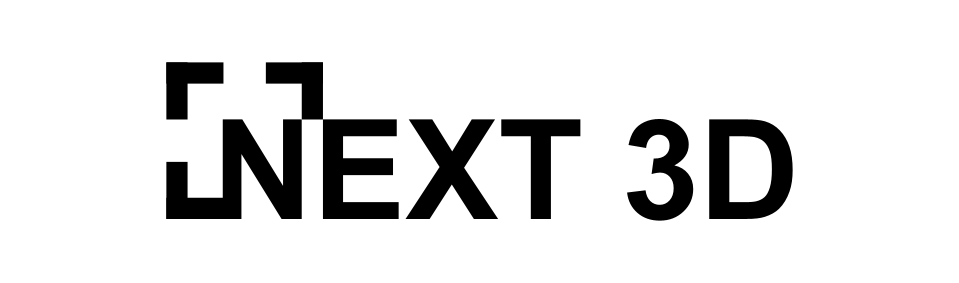

# NEXT 3D
[[Project]](https://next-3d.com) [[Publication]](#) [[PDF Format]](#) [[BibTeX]](#) [[Video]](#) 
Aarav H. Dave1
> This repository currently does not contain project files.

## Summary
NEXT 3D is an in silico approach to nanoparticle design optimization for crossing the blood-brain barrier (BBB) for the treatment of glioblastoma multiforme (GBM), a proliferative and highly fatal central nervous system (CNS) cancer. NEXT 3D achieves this through simulation of nanoparticles interacting the capillary bed; it is validated against data from in vitro and in vivo studies on nanoparticle-BBB interactions for various designs. This repository hosts project files (2024.1.1) for public usage dictated by its license.

## Abstract
Glioblastoma multiforme, an aggressive and highly lethal form of central nervous system cancer, is characterized by its resistance to conventional therapies due to the impermeability of the blood-brain barrier (BBB). Nanoparticle-based treatments are inhibited by their inability to effectively penetrate the BBB and to selectively target tumor cells. Despite promising in vitro and in vivo results, nanoparticle-based treatments often fail in humans due to the complexity of their microenvironments even in comparison with anatomically similar organisms. This study introduces a real-time, 3-D simulation model, NEXT 3D, designed to evaluate custom nanoparticles both for their ability to penetrate the BBB and for their thermotherapeutic efficacy. Users can adjust nanoparticle parameters at the molecular level, such as size, shape, composition, and polarity, to optimize penetration. The Python-developed environment gives the user control over thermal conditions and regionally tracks temperature levels to determine potential cell apoptosis. Key metrics are monitored to evaluate therapeutic efficacy; simulated 15 nm gold nanoparticles were validated against in vitro and in vivo benchmarks to confirm realistic outcomes. NEXT 3D is intended as a complementary tool to accelerate preclinical designs that require further in vivo validation. Enhancements will focus on breadthening simulation capability to greater therapeutic interventions through performance optimization. This study aims to provide a tool for accelerating the production and optimization of nanoparticle designs in various oncological contexts.

## Paper
*Coming Soon*

## Recognitions
- Delegation, 2024 American Junior Academy of Sciences

## Technical Specifications
This software was made in Python with 3-D visualization conducted via the parent library p3D.

## License
This software, as with all subsequent versions of the software, is protected by the CC-BY-NC-ND license. In summary, this does not allow commercial usage, distribution, or distribution of modifications of the software. In additon, you are required to credit authorship and state any changes you may have made.
> For more information, please refer to the `LICENSE` file.

## Contacts
For questions concerning the contents of this repository, please contact contact [at] next-3d [dot] com.
###### 1 Lowndes High School, Valdosta, GA
